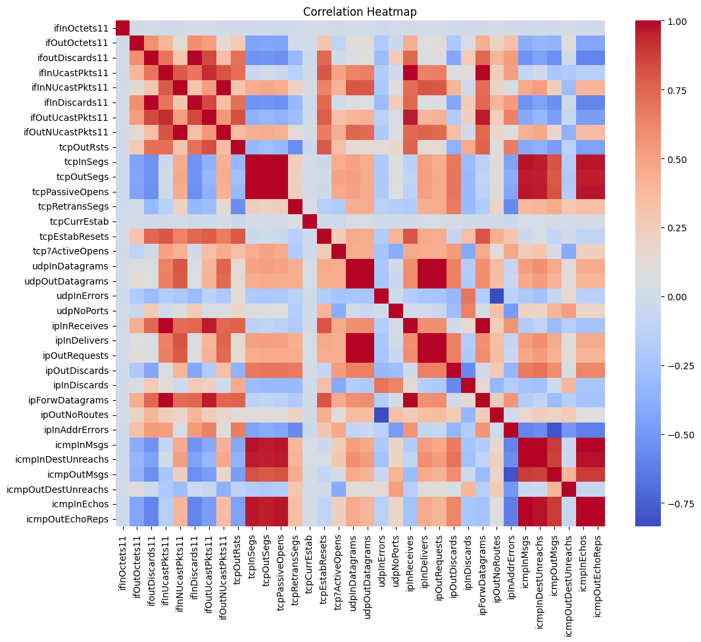
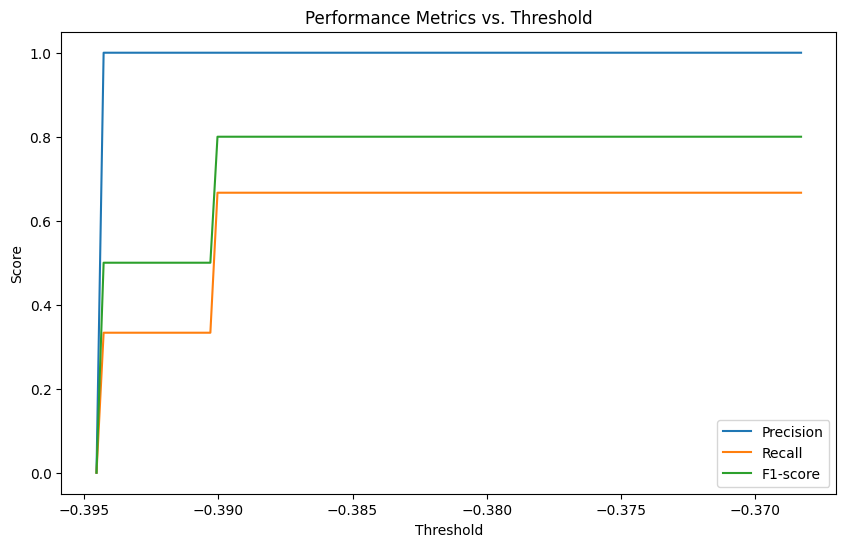

# Anomaly Detection System Using Isolation Forest

## Project Objectives

- **Develop an anomaly detection system using Isolation Forest.**
- **Analyze and visualize the feature importance and performance of the model.**

## Methodology Overview

### Data Preparation

- Cleaned and preprocessed the data to ensure it was suitable for model training.
- Handled missing values, outliers, and ensured data consistency.

### Model Training

- Used the Isolation Forest algorithm for detecting anomalies within the dataset.
- Tuned hyperparameters to optimize the model's performance.

### Evaluation

- Evaluated the model's performance using precision, recall, and F1-score metrics to measure its effectiveness in identifying anomalies.

## Key Insights from Data Exploration

- **Visualization of Feature Distributions:** Differences between normal and anomaly data were observed, helping to better understand the characteristics of the anomalies.
- **Feature Importance Analysis:** The most influential features in determining anomalies were identified, providing insights into which aspects of the data are most indicative of abnormal behavior.

## Model Performance Comparisons

### DBSCAN Performance

- **Precision:** 1.0000
- **Recall:** 1.0000
- **F1-score:** 1.0000

### Isolation Forest Performance

- **Precision:** 1.0000
- **Recall:** 0.3333
- **F1-score:** 0.5000

## Conclusion and Recommendations

### Conclusion

The anomaly detection system using Isolation Forest was successfully developed and evaluated. The model was able to identify anomalies with high precision, but the recall was lower compared to the DBSCAN model. This indicates that while the Isolation Forest was effective at minimizing false positives, it may require further tuning or additional features to improve its ability to catch all anomalies.

### Recommendations

- **Future Work:** It is recommended to explore other anomaly detection algorithms, such as DBSCAN, or to experiment with ensemble methods that combine multiple models for better performance.
- **Feature Engineering:** Additional feature engineering could help improve the model's recall by providing more relevant information to distinguish between normal and anomalous data.
- **Model Tuning:** Fine-tuning the Isolation Forest hyperparameters and exploring different configurations could enhance its overall performance.

## Dataset

To access the dataset used in this project, please follow the link below:

[Anomaly Detection Data](https://drive.google.com/file/d/1idvHhosrfQANj43-s14weP1agA88XBOx/view)


## Visualizations



## Getting Started

### Prerequisites
- Python 3.8 or higher
- Required libraries: `pandas`, `numpy`, `scikit-learn`, `matplotlib`, `seaborn`

### Installation

1. Clone this repository:
    ```bash
    git clone https://github.com/yourusername/anomaly-detection.git
    ```
2. Navigate to the project directory:
    ```bash
    cd anomaly-detection
    ```
3. Install the required packages:
    ```bash
    pip install -r requirements.txt
    ```

### Usage

1. Run the main analysis script:
    ```bash
    python main.py
    ```

2. To visualize the results, use the following code to display the analysis image:

    ```python
    import matplotlib.pyplot as plt

    # Assuming `image_path` is the path to your analysis image
    image_path = 'path/to/your/image.png'

    # Load and display the image
    img = plt.imread(image_path)
    plt.figure(figsize=(10, 6))
    plt.imshow(img)
    plt.axis('off')  # Hide the axis
    plt.show()
    ```


   

## Contributing

If you'd like to contribute to this project, please fork the repository and use a feature branch. Pull requests are warmly welcome.


## Contact

For any questions or inquiries, please contact [pallavisikha122@gmail.com].

## Note

The presentation and documentation for this project are attached in the `.ipynb` file.
